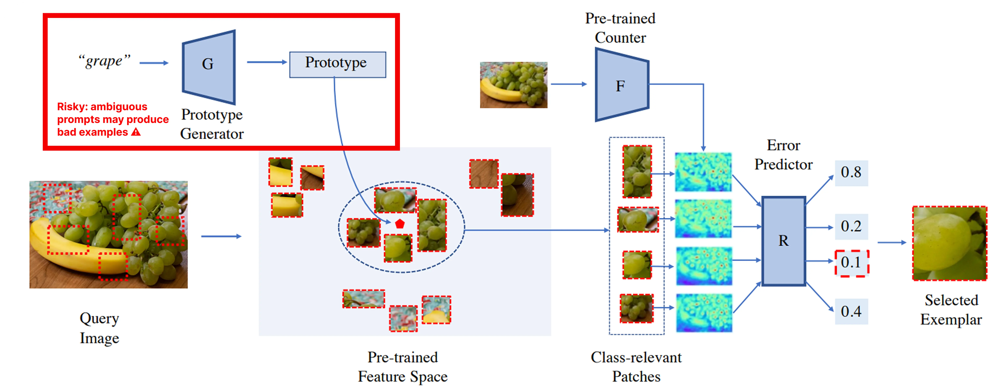
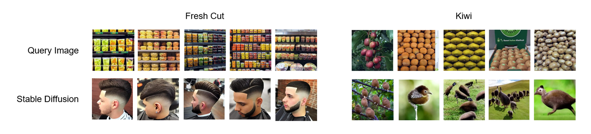
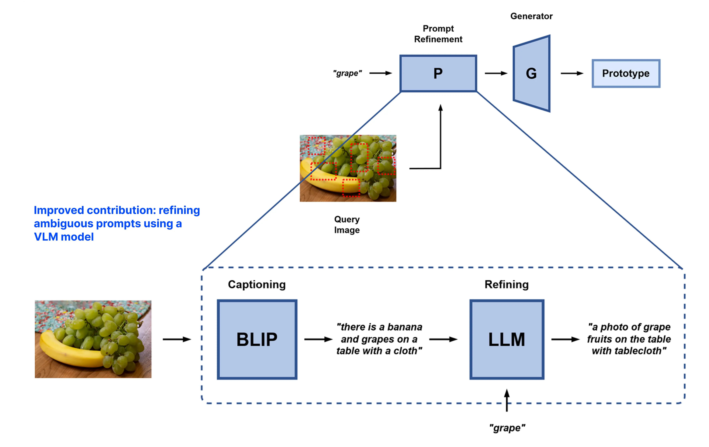

# Refining Ambiguous Prompts for Zero Shot Object Counting via Vision Lanugage Model Approach

This project presents an additional process designed to improve object counting without relying on human annotations. While current diffusion based methods are powerful, they often struggle with **vague class names and fail to create accurate visual representations for counting**. This work addresses these weaknesses by adding a refinement step that uses vision language models to improve the instructions provided to the diffusion process.

> *Keywords: Zero-Shot Counting, Vision Language Models, Prompt Engineering, Diffusion Models*

## 🎯 Baseline Framework (Zero Shot Object Counting)

  
  

The architecture focuses on *bridging the gap between raw images and precise counting targets*. The system relies on a diffusion based process to generate visual prototypes, which serve as the foundation for counting objects in a zero shot setting.

A major problem in current systems is the problem of **label ambiguity**. Models often fail because they treat generic labels like fresh cut as literal descriptions, or confuse names like kiwi with unrelated concepts. These misinterpretations prevent the model from identifying the correct objects and cause a significant drop in counting performance.

## 🧠 Proposed Methodology

  

To improve the generation of visual prototypes and ensure they accurately match the target environment, the framework incorporates an **automated prompt refinement pipeline**. The process uses **BLIP** to generate *descriptive captions from the input image*, which are then processed by the **Phi 3 model** to construct *more precise and contextual prompts*. By leveraging these refined prompts for the diffusion process, the system ensures that the `generated visual prototypes are correctly aligned with the target objects`. For ambiguity mitigation, the refinement step transforms vague labels into detailed descriptions, allowing the diffusion model to better distinguish between concepts and reduce classification errors.

## 🔧 Installation

Comming soon

## 🧾 Acknowledgement

This project is built on top of the official `zero-shot-counting` and `Learning To Count Everything` repositories. Sincere thanks to the authors for their open-source implementations and contributions to object counting research.
> https://github.com/cvlab-stonybrook/zero-shot-counting (Zero-Shot Object Counting)  
> https://github.com/cvlab-stonybrook/LearningToCountEverything (Learning To Count Everything)

## 👤 Authors

**Kevin Wijaya**\*¹

¹ Department of Electrical Engineering and Computer Science 
National Yang Ming Chiao Tung University (NYCU)  
